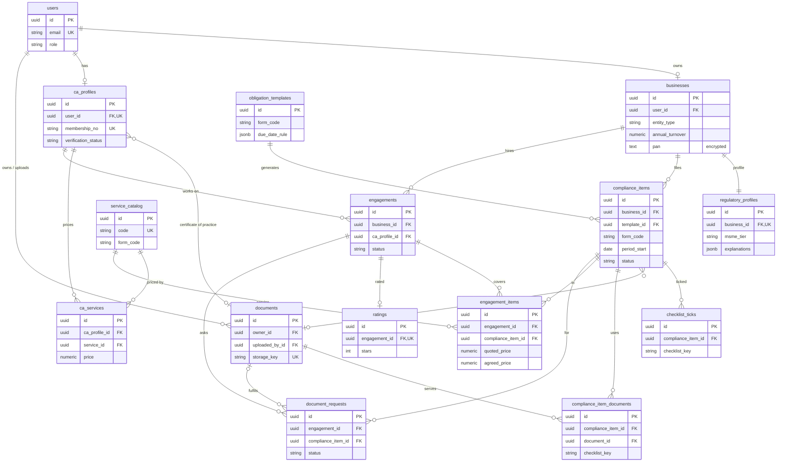
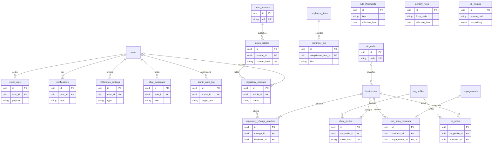

# Data model

> **The whole v1 schema exists.** Every table below was created by migration `schema: complete data model`
> (`backend/migrations/versions/…_schema_complete_data_model.py`) or an earlier one. Services, routes and pages
> come module by module; a module that needs a column change adds its own migration and updates this file.
> Models: one file per module in `backend/app/models/`.

## Global rules (from CLAUDE.md)
- Every model subclasses `BaseModel` (`backend/app/models/base.py`): primary key `id` is a **UUID** (uuid4,
  generated in Python, Postgres `uuid` type); foreign keys are therefore UUID columns too.
- Timestamps: every table has `created_at` and `updated_at` (`TimestampMixin`), timezone-aware UTC, with a
  database default `now()`; display in Asia/Kolkata. Other times are `timestamptz` too.
- **Soft delete for entities** (`SoftDeleteMixin`: `is_active` + `deleted_at`). **Pure link or one-off rows are
  deleted normally:** `checklist_ticks`, `compliance_item_documents`, `ratings`. Rows that end through a status
  (engagements, invites, requests) or dates (reference data) have neither.
- **UNIQUE on a soft-deleted table:** a soft-deleted row still counts for a plain UNIQUE. Where a live row must
  be creatable again, the table uses a **partial unique index on live rows** (`WHERE deleted_at IS NULL`, named
  `ux_<table>_...`): `businesses (user_id)`, `compliance_items (business_id, form_code, period_start)`.
- Enums: Python `StrEnum` with lowercase snake_case values, stored as text with a CHECK constraint via
  `str_enum()` (`backend/app/models/enums.py`). Constraint name: `ck_<table>_<enum_name_in_snake_case>`.
  Adding a value needs a hand-written migration that replaces the CHECK constraint. Lists of codes are Postgres
  arrays checked with `only_codes()` (`ck_<table>_known_<column>`).
- Money: `Numeric(12, 2)` rupees ↔ Python `Decimal`. Rates: `Numeric(5, 2)` percent.
- Financial year: April–March, stored as a string like `2026-27` (CHECK `^[0-9]{4}-[0-9]{2}$` on compliance items).
- **Encrypted fields** (PAN, GSTIN, TAN, phone) use `EncryptedString` (`backend/app/utils/encryption.py`, Fernet,
  key `FIELD_ENCRYPTION_KEY`). They are `text` in the database, **not searchable and not unique**: there is no
  blind index, because we never look a business up by them. Passwords are argon2 hashes. Uploaded files are
  encrypted on disk; only metadata is in the database.
- Legal rules are **data**: `rule_thresholds`, `obligation_templates` and `penalty_rules` have `source_reference`,
  `effective_from`, `effective_to` (CHECK `effective_to > effective_from`). Unverified values have `TODO_VERIFY`
  in `source_reference` and are listed in `docs/TODO_VERIFY.md`. Never invent one.
- **Content stays in files**, not in the database: explanations, instructions and checklists live in
  `content/forms/<FORM>/`; rows store only keys such as `checklist_key`.
- No cascading deletes. Constraint and index names follow the naming convention in `backend/app/extensions.py`.
- A module never imports another module's models; it calls that module's service functions.

## Tables

Column types are in the model files; this lists what each table is for and its key fields. "SD" = soft delete.

### core-auth (`models/user.py`, `models/email_otp.py`)
| Table | One row is... | Key fields |
|---|---|---|
| `users` (SD) | a login account | email (unique, trimmed + lowercased), password_hash (argon2), full_name, role (`user_role`), email_verified_at (null until the emailed code is entered), terms_accepted_at (null until signup sets it, a later task) |
| `email_otps` | a 6-digit code emailed to a user | user_id → users (indexed), purpose (`otp_purpose`), code_hash (argon2), expires_at, attempts, used_at. Never deleted; only the newest code per user and purpose counts |

### onboarding (`models/onboarding.py`)
| Table | One row is... | Key fields |
|---|---|---|
| `businesses` (SD) | a registered business | user_id → users (**one live business per user**: `ux_businesses_user_id`), legal_name, entity_type, state, address, description, annual_turnover (an **amount**, `Numeric(12,2)`), investment_amount, pan (enc), phone (enc), gst_registered + gstin (enc), gst_composition (the business chose the composition scheme; default false), gst_qrmp (chose quarterly returns within the QRMP limit; default false), accounts_audited_other_law (partnerships and LLPs; default false), deducts_tds + tan (enc), pays_salary_above_limit, cin_llpin, udyam_number, nic_code_id → nic_codes. CHECKs: `gstin_when_gst_registered`, `tan_when_deducts_tds`, `cin_llpin_for_llp_and_company`, `amounts_not_negative` |
| `regulatory_profiles` | the current computed profile of one business | business_id → businesses (unique, 1–1), msme_tier, gst_scheme, gst_registration_suggested, itr_form, presumptive_eligible, audit_applicable (tax audit, s.44AB), other_audit_applicable (accounts audited under another law; either audit moves the ITR due date), files_24q, files_26q, roc_not_tracked, explanations (JSONB, a "why" per line), rule_version (`v2`), computed_at. Recomputed in place on every edit |
| `nic_codes` | an official NIC activity code | code (unique), description. Imported from the official list, never invented |
| `rule_thresholds` | one legal threshold or value | key, value (`Numeric(18,4)`), unit (e.g. `inr`, `percent`), description, source_reference, effective_from, effective_to. Unique (key, effective_from) |

### compliance (`models/compliance.py`)
| Table | One row is... | Key fields |
|---|---|---|
| `obligation_templates` | how a form applies and when it is due | form_code, name, frequency, applicability (JSONB), due_date_rule (JSONB), source_reference, effective_from, effective_to. Unique (form_code, frequency, effective_from): GSTR-1 monthly and quarterly are two templates |
| `compliance_items` (SD) | one filing of one business for one period | business_id → businesses, template_id → obligation_templates, form_code, fy, period_label, period_start, period_end, due_date (indexed), status, filing_path (null until chosen), is_nil_return, filed_at, acknowledgement_no, verified_at, acknowledgement_document_id → documents. **One live item per business, form and period** (`ux_compliance_items_business_form_period`) |
| `checklist_ticks` | a ticked checklist entry of one filing | compliance_item_id → compliance_items, checklist_key (from `content/forms/<FORM>/checklist.yaml`). Unique (item, key). Unticking deletes the row |

### documents (`models/documents.py`)
| Table | One row is... | Key fields |
|---|---|---|
| `documents` (SD) | an uploaded file's metadata | owner_id → users (indexed; a business user, or a CA for their Certificate of Practice), uploaded_by_id → users (can differ: a CA uploading a client's acknowledgement), doc_type, original_filename, storage_key (unique), mime_type, size_bytes, sha256, fy, period_label, ocr_status, ocr_fields (JSONB) |
| `compliance_item_documents` | a file serving one filing (N–N) | compliance_item_id, document_id, checklist_key (never empty; `general` when not for a checklist entry), linked_by_id → users. Unique (item, document, key): one file can serve several filings. Unlinking deletes the row. **(implemented, DO6)** linking to a checklist key ticks it; a filed filing's links are fixed |

### alerts (`models/alerts.py`)
| Table | One row is... | Key fields |
|---|---|---|
| `notifications` (SD) **(implemented, AL1)** | a tray entry | user_id → users (indexed), type, title, body, link (an app path), read_at. Soft-deleted when dismissed |
| `notification_settings` **(implemented, AL3)** | a user's email preference for one type | user_id, type, email_enabled. Unique (user, type); no row = email on. Only `deadline_reminder`, `overdue`, `document_request`, `regulatory_update` are switchable; `engagement_update` and `account` are always emailed |
| `reminder_log` **(implemented, AL2)** | a reminder already sent | compliance_item_id, kind, sent_at. Unique (item, kind): never sent twice |
| `penalty_rules` **(implemented, AL4/AL5)** | late fee and interest for one form | form_code, late_fee_per_day, max_late_fee (null = no cap), **flat_late_fee** (a fixed fee charged once, e.g. the ITR; used instead of the per-day fee when set; CHECK `flat_late_fee_not_negative`), annual_interest_rate, nil_return_late_fee_per_day (null = same), source_reference, effective_from, effective_to. **Every amount is nullable: NULL = not confirmed yet** (the estimator skips it; migration `alerts: nullable penalty amounts and flat late fee`). Unique (form_code, effective_from); matched by form code + the filing's due date, no FK. Seeded: 7 rows, every amount NULL, `TODO_VERIFY` |

### marketplace (`models/marketplace.py`)
| Table | One row is... | Key fields |
|---|---|---|
| `ca_profiles` (SD) | a CA's practice profile | user_id → users (unique: one per CA), membership_no (6 digits, unique), cop_number (typed by the CA), city, languages and specializations (`varchar[]` of codes, CHECKs `known_languages` / `known_specializations`, GIN index on specializations), **capacity** (= max active clients), years_experience, **about** (= bio), verification_status, pro_bono_slots_per_month (≥ 0), rejection_reason, verified_at, verified_by_id → users (the admin), cop_document_id → documents (the Certificate of Practice) |
| `service_catalog` (SD) | a standard service every CA prices against | code (unique, e.g. `gstr_3b`), name, description, unit (`service_unit`), sort_order, form_code (null for services that are not one filing, e.g. tax audit). Class `CatalogService`. No stored typical prices: computed from `ca_services` |
| `ca_services` (SD) | one CA's price for one catalog service (N–N) | ca_profile_id, service_id, price (> 0). Unique (ca_profile_id, service_id): unticking soft-deletes, ticking again reactivates the same row |
| `engagements` | one business working with one CA | business_id → businesses, ca_profile_id → ca_profiles (both indexed), status, is_pro_bono, quote_reason (required when quoted), requested_at, responded_at, expires_at, activated_at, completed_at. A business may have several CAs at once |
| `engagement_items` | one filing in an engagement | engagement_id, compliance_item_id, service_id → service_catalog, listed_price, quoted_price (the CA's quote; null unless quoted; CHECK `ck_engagement_items_quoted_price_not_negative` ≥ 0), agreed_price (null until agreed). Unique (engagement, item) |
| `ratings` **(implemented, MA17)** | the business's review of one engagement | engagement_id (unique), stars (CHECK 1–5), review (null when empty). Deleted normally. Averages are computed, never stored |
| `client_invites` | a CA's invitation to an existing client | ca_profile_id, email (indexed), token_hash (SHA-256, unique; the token is never stored), status, expires_at, accepted_business_id → businesses |
| `pro_bono_requests` **(implemented, MA16)** | a business in the pro-bono queue | business_id, status (`queued` / `matched` / `cancelled`), note, compliance_item_ids (uuid[]: the filings asked for; not a foreign key), engagement_id → engagements (unique; null while queued) |

### ca_workspace (`models/ca_workspace.py`)
| Table | One row is... | Key fields |
|---|---|---|
| `document_requests` | a CA's request for one document | engagement_id (indexed), compliance_item_id, checklist_key, message, status, fulfilled_at, document_id → documents (the file that answered it) |
| `ca_notes` (SD) | a CA's private note about a client | ca_profile_id, business_id (indexed together), body |

### regulatory (`models/regulatory.py`)
| Table | One row is... | Key fields |
|---|---|---|
| `news_sources` | a site or feed we scrape | name, url (unique), kind, enabled |
| `news_articles` | a scraped article | source_id, url (unique), title, published_at, content, content_hash (SHA-256, unique) |
| `regulatory_changes` | a change extracted from an article | article_id, change_type, summary, form_codes (`varchar[]` of form codes, CHECK `known_form_codes`), affected_categories (JSONB), dates (JSONB), status, reviewed_at, reviewed_by_id → users |
| `regulatory_change_matches` | a business affected by an approved change (N–N) | change_id, business_id (indexed), notified_at. Unique (change, business) |

### assistant (`models/assistant.py`)
| Table | One row is... | Key fields |
|---|---|---|
| `kb_chunks` | a chunk of our content or an official FAQ | source_path, title, url, chunk_index, content, embedding `vector(768)` (pgvector). Unique (source_path, chunk_index). No FKs, no user data; no vector index yet (exact search is fast enough at this size) |
| `chat_messages` (SD) | one message of a user's assistant chat | user_id → users (indexed), role, content, citations (JSONB) |

### admin (`models/admin.py`)
| Table | One row is... | Key fields |
|---|---|---|
| `admin_audit_log` | one admin action | admin_id → users (indexed), action, target_type, target_id (no FK: any table), details (JSONB, never PII or document contents). Append-only |

## Relationships

Cardinality is read left to right: "1–N" = one row on the left has many on the right.

| From | Cardinality | To | Through |
|---|---|---|---|
| users | 1–0..1 | businesses | `businesses.user_id` (live rows unique; role `business` only, a service rule) |
| users | 1–0..1 | ca_profiles | `ca_profiles.user_id` unique (role `ca` only, a service rule) |
| users | 1–N | email_otps, notifications, notification_settings, chat_messages | `user_id` |
| users | 1–N | documents (as owner) / documents (as uploader) | `owner_id` / `uploaded_by_id` |
| users (admin) | 1–N | admin_audit_log, ca_profiles (verified_by), regulatory_changes (reviewed_by) | |
| businesses | 1–1 | regulatory_profiles | `regulatory_profiles.business_id` unique |
| nic_codes | 1–N | businesses | `businesses.nic_code_id` (N–0..1 from the business side) |
| businesses | 1–N | compliance_items, engagements, pro_bono_requests, ca_notes | `business_id` |
| obligation_templates | 1–N | compliance_items | `template_id` |
| compliance_items | 1–N | checklist_ticks, reminder_log | `compliance_item_id` |
| compliance_items | N–0..1 | documents (acknowledgement) | `acknowledgement_document_id` |
| compliance_items | N–N | documents | `compliance_item_documents` (+ checklist_key, linked_by) |
| ca_profiles | N–N | service_catalog | `ca_services` (+ price) |
| ca_profiles | N–0..1 | documents (Certificate of Practice) | `cop_document_id` |
| businesses / ca_profiles | 1–N / 1–N | engagements | `business_id`, `ca_profile_id` |
| engagements | 1–N | engagement_items | each item → one compliance_item and one service_catalog row |
| engagements | 1–0..1 | ratings | `ratings.engagement_id` unique |
| engagements | 1–N | document_requests | each → one compliance_item, 0..1 fulfilling document |
| ca_profiles | 1–N | client_invites, ca_notes | `ca_profile_id`; an invite → 0..1 accepted business |
| pro_bono_requests | N–0..1 | engagements | `engagement_id` unique (0..1 each way) |
| news_sources | 1–N | news_articles | 1–N regulatory_changes (`article_id`) |
| regulatory_changes | N–N | businesses | `regulatory_change_matches` (+ notified_at) |

**Service rules the database cannot enforce** (the owning service checks them; tests there):
- Only a `business` user owns a business; only a `ca` user has a CA profile.
- A compliance item is in at most **one open engagement** (status `requested`, `quoted` or `active`) (marketplace).
- A document request's compliance item belongs to its engagement (an `engagement_items` row) (ca_workspace).
- A soft-deleted filing that comes back is a new row; services look at live rows only.
- `ca_profiles` and `service_catalog` are never re-inserted after soft delete. Removing then re-adding
  reactivates the existing row (keeps `user_id`/`membership_no`/`code` unique). Their UNIQUEs are plain, not
  partial, so a new row would fail (marketplace).

### Diagram 1: filings, documents and the marketplace

### Diagram 2: everything else

`users`, `businesses`, `compliance_items`, `ca_profiles` and `engagements` appear again only as anchors (their
fields are in diagram 1).

`rule_thresholds`, `penalty_rules` and `kb_chunks` have no foreign keys: reference data is matched by key, form
code and date; the knowledge base holds no user data.

## Status values

This section is the one authoritative list of these values. Module docs and code refer here; changing a value
means telling the team (it is a contract). The **code** is what the database stores and the API sends
(lowercase snake_case, via `str_enum()`); the **label** is display text only, shown by the frontend through
`frontend/src/lib/labels.js`, which gets a map for each enum once it reaches the UI (today: `users.role` and the
`ca_profiles` and `service_catalog` codes) and must match these tables. The migration that creates each column
fixes its CHECK constraint to exactly these codes.

**`users.role`** (core-auth; `UserRole` in `backend/app/models/enums.py`; CHECK `ck_users_user_role`)

| Code | Label | Notes |
|---|---|---|
| `business` | Business | business owner / gig worker; home `/business` |
| `ca` | Chartered Accountant | home `/ca` |
| `admin` | Admin | home `/admin` |

Also the `role` claim in the JWT.

**`email_otps.purpose`** (core-auth; `OtpPurpose` in `backend/app/models/email_otp.py`; CHECK `ck_email_otps_otp_purpose`)

| Code | Label | Notes |
|---|---|---|
| `verify_email` | Email verification | sent at signup and on resend |
| `reset_password` | Password reset | sent by forgot-password |

Never shown in the UI, so `labels.js` has no map for it.

**Form codes** (`FormCode` in `backend/app/models/enums.py`; `form_code` of `obligation_templates`,
`compliance_items`, `penalty_rules`, `service_catalog`; items of `regulatory_changes.form_codes`)

| Code | Label | Content folder |
|---|---|---|
| `itr` | Income tax return (ITR) | `content/forms/ITR/` (the profile picks ITR-3/4/5/6) |
| `gstr_1` | GSTR-1 | `content/forms/GSTR-1/` |
| `gstr_3b` | GSTR-3B | `content/forms/GSTR-3B/` |
| `cmp_08` | CMP-08 | `content/forms/CMP-08/` |
| `gstr_4` | GSTR-4 | `content/forms/GSTR-4/` |
| `tds_24q` | TDS return 24Q (salaries) | `content/forms/24Q/` |
| `tds_26q` | TDS return 26Q (other payments) | `content/forms/26Q/` |

The same seven codes start `ca_profiles.specializations`, so "CAs for this form" is a filter on one code.

**`businesses.entity_type`** (onboarding; `EntityType` in `backend/app/models/onboarding.py`)

| Code | Label | Notes |
|---|---|---|
| `individual` | Individual (freelancer / gig worker) | |
| `proprietorship` | Proprietorship | |
| `partnership` | Partnership firm | |
| `llp` | LLP | needs `cin_llpin` (the LLPIN); ROC/MCA filings not tracked |
| `private_limited` | Private limited company | needs `cin_llpin` (the CIN); ROC/MCA filings not tracked |

**`regulatory_profiles.msme_tier`** (`MsmeTier`): `micro` Micro · `small` Small · `medium` Medium · `not_msme` Not an MSME

**`regulatory_profiles.gst_scheme`** (`GstScheme`): `not_registered` Not registered · `regular_monthly` Regular (monthly) ·
`regular_qrmp` Regular (quarterly, QRMP) · `composition` Composition

**`regulatory_profiles.itr_form`** (`ItrForm`): `itr_3` ITR-3 · `itr_4` ITR-4 · `itr_5` ITR-5 · `itr_6` ITR-6

**`obligation_templates.frequency`** (compliance; `Frequency`): `monthly` Monthly · `quarterly` Quarterly · `yearly` Yearly

**`compliance_items.form_code`, `obligation_templates.form_code`** (`FormCode` in `backend/app/models/enums.py`): `itr` Income tax return (ITR) ·
`gstr_1` GSTR-1 · `gstr_3b` GSTR-3B · `cmp_08` CMP-08 · `gstr_4` GSTR-4 · `tds_24q` TDS return 24Q (salaries) ·
`tds_26q` TDS return 26Q (other payments)

**`compliance_items.status`** (compliance; `ComplianceStatus` in `backend/app/models/compliance.py`)

| Code | Label | Notes |
|---|---|---|
| `upcoming` | Upcoming | initial state |
| `docs_pending` | Docs pending | |
| `ready` | Ready | |
| `with_ca` | With CA | set from marketplace engagements |
| `filed` | Filed | |
| `filed_verified` | Filed–verified | acknowledgement verified (OCR) |
| `overdue` | Overdue | set by the hourly worker job from `upcoming`, `docs_pending` or `ready` once the due date has passed; a `with_ca` filing stays `with_ca` |

Lifecycle: `upcoming → docs_pending → ready → with_ca → filed → filed_verified`, plus `overdue` from the states
before `with_ca` (the CA handles a late `with_ca` filing; pages show how late it is from `due_date`).

**`compliance_items.filing_path`** (`FilingPath`): `self` Self-file · `ca` Through a CA (null until the business chooses)

**`documents.doc_type`** (documents; `DocumentType` in `backend/app/models/documents.py`)

| Code | Label |
|---|---|
| `gst_certificate` | GST registration certificate |
| `pan_card` | PAN card |
| `sales_register` | Sales register |
| `purchase_register` | Purchase register |
| `bank_statement` | Bank statement |
| `invoice` | Invoice |
| `salary_register` | Salary register |
| `tds_challan` | TDS challan |
| `acknowledgement` | Filing acknowledgement |
| `certificate_of_practice` | Certificate of Practice (CA) |
| `other` | Other |

**`documents.ocr_status`** (`OcrStatus`): `none` Not processed · `processed` Processed · `failed` Failed

**`notifications.type`, `notification_settings.type`** (alerts; `NotificationType` in `backend/app/models/alerts.py`)

| Code | Label |
|---|---|
| `deadline_reminder` | Deadline reminder |
| `overdue` | Overdue filing |
| `engagement_update` | CA request update |
| `document_request` | Document request |
| `regulatory_update` | Regulatory update |
| `account` | Account |

**`reminder_log.kind`** (`ReminderKind`): `t_minus_7` 7 days before · `t_minus_3` 3 days before · `t_minus_1` 1 day before ·
`overdue` Overdue

**`ca_profiles.verification_status`** (marketplace; `CaVerificationStatus` in `backend/app/models/marketplace.py`;
CHECK `ck_ca_profiles_ca_verification_status`)

| Code | Label | Notes |
|---|---|---|
| `pending` | Pending verification | a new profile; also after a verified/rejected CA changes the membership or CoP number, or a rejected CA saves again |
| `verified` | Verified | set by an admin; only verified CAs are listed for businesses |
| `rejected` | Rejected | set by an admin; the CA corrects the details and saves |

**`ca_profiles.specializations`** (marketplace; `CA_SPECIALIZATIONS` in `backend/app/models/marketplace.py`; an
array of these codes, at least one)

| Code | Label |
|---|---|
| `itr` | Income tax return (ITR) |
| `gstr_1` | GSTR-1 |
| `gstr_3b` | GSTR-3B |
| `cmp_08` | CMP-08 |
| `gstr_4` | GSTR-4 |
| `tds_24q` | TDS return 24Q (salaries) |
| `tds_26q` | TDS return 26Q (other payments) |
| `gst_registration` | GST registration |
| `tax_audit` | Tax audit |
| `accounting_bookkeeping` | Accounting & bookkeeping |
| `income_tax_notices` | Income-tax notices |
| `company_llp_compliance` | Company / LLP compliance |
| `startup_msme_advisory` | Startup & MSME advisory |

The first seven are the forms we track, so "CAs for this form" is a filter on one code.

**`ca_profiles.languages`** (marketplace; `CA_LANGUAGES`; an array of these codes, at least one)

`english` English · `hindi` Hindi · `bengali` Bengali · `gujarati` Gujarati · `kannada` Kannada ·
`malayalam` Malayalam · `marathi` Marathi · `odia` Odia · `punjabi` Punjabi · `tamil` Tamil · `telugu` Telugu ·
`urdu` Urdu

Adding a code to either array list needs a hand-written migration that replaces its CHECK constraint.

**`service_catalog.unit`** (marketplace; `ServiceUnit` in `backend/app/models/marketplace.py`; CHECK
`ck_service_catalog_service_unit`)

| Code | Label | Notes |
|---|---|---|
| `per_return` | per return | one filing (GSTR-1, GSTR-3B, ITR, TDS returns, …) |
| `per_month` | per month | e.g. bookkeeping |
| `per_year` | per year | e.g. tax audit |
| `one_time` | one time | e.g. GST registration |
| `per_notice` | per notice | replying to one income-tax notice |

**`engagements.status`** (marketplace; `EngagementStatus` in `backend/app/models/marketplace.py`)

| Code | Label | Notes |
|---|---|---|
| `requested` | Requested | initial state; expires 48 hours later if unanswered |
| `quoted` | Quote sent | the CA sent a different price (`quote_reason` required) |
| `active` | Active | the CA accepted the listed prices, or the business accepted the quote |
| `completed` | Completed | the work is done; the business can rate it |
| `declined` | Declined | the CA declined |
| `expired` | Expired | no answer within 48 hours; the business is re-matched |
| `cancelled` | Cancelled | the business withdrew the request |

Lifecycle: `requested → active` (CA accepts the listed prices) or `requested → quoted → active` (business accepts
the quote); `requested`/`quoted` can end `declined`, `expired` or `cancelled`; `active → completed`. There is no
`accepted` status. **Open** = `requested`, `quoted` or `active`.

**`client_invites.status`** (`InviteStatus`): `pending` Pending · `accepted` Accepted · `expired` Expired · `cancelled` Cancelled

**`pro_bono_requests.status`** (`ProBonoRequestStatus`): `queued` In the queue · `matched` Matched to a CA · `cancelled` Cancelled

**`document_requests.status`** (ca_workspace; `DocumentRequestStatus`): `open` Open · `fulfilled` Fulfilled · `cancelled` Cancelled

**`news_sources.kind`** (regulatory; `NewsSourceKind`): `rss` RSS feed · `html` Web page

**`regulatory_changes.change_type`** (`ChangeType`): `due_date_extension` Due date extension · `rate_change` Rate change ·
`new_rule` New rule · `other` Other

**`regulatory_changes.status`** (`RegulatoryChangeStatus`): `pending` Awaiting review · `approved` Approved · `rejected` Rejected.
Only an approved change reaches businesses.

**`chat_messages.role`** (assistant; `ChatRole`): `user` You · `assistant` Assistant

## Access rules

Who may read what. Every endpoint enforces these through the role decorators and these service functions
(CLAUDE.md rule 5); the database stores no permissions.

| Who | May read |
|---|---|
| A business user | all of its own data |
| A CA with a `requested` or `quoted` engagement | a **profile summary** of that business (entity type, state, MSME tier, turnover bracket) and **the filings in that request**. No PAN, GSTIN or TAN, no documents |
| A CA with an **`active`** engagement | the full business profile, **only the filings in that engagement**, and **only the documents linked to those filings** (`compliance_item_documents`, acknowledgements, fulfilled document requests) |
| A CA after the engagement is `completed`, `declined`, `expired` or `cancelled` | nothing of that business, except the rating of their own engagement |
| An admin | all metadata, **never document contents** |

Service functions (marketplace, built in MA14), the only way a CA's access is decided:
- `ca_has_active_access(ca_profile_id, business_id)`: true while an engagement between them is `active`.
- `open_engagement_item_ids(ca_profile_id, business_id)`: the compliance items in their open engagements.
- `ca_can_access_document(ca_profile_id, document_id)`: true only for a document linked to one of the filings of
  an active engagement.
- Also `active_engagement_item_ids(ca_profile_id, business_id)` (the filings in active engagements only) and, for
  routes, `require_ca_access(business_id)` in `app/utils/decorators.py` (404 unless active access). Fulfilled
  document requests (ca_workspace) are not included yet: that table has no code.

The turnover bracket shown before acceptance is computed from `annual_turnover`; the amount itself is not shown.

## Cross-module dependencies to watch
- `ca_has_active_access` and the other access functions need engagement status from marketplace → marketplace
  service functions, not model imports.
- Compliance status "With CA" (compliance) comes from marketplace engagements (marketplace).
- Documents (documents) are attached to compliance items (compliance) and used by ca_workspace and marketplace
  (Certificate of Practice).
- CA urgency (ca_workspace) takes input from regulatory changes (regulatory) and compliance items (compliance).
- `FormCode` (shared enum) ties compliance, alerts, marketplace and regulatory together; content folders use the
  display names (`content/forms/GSTR-3B/`).
