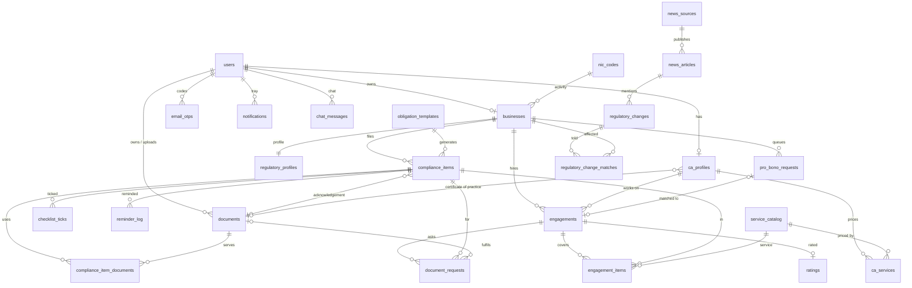

# Data model

Every table is a class in `backend/app/models.py`; the schema is built by the one migration in
`backend/migrations/versions/` (`flask --app app db upgrade`). A change to a model needs a new migration
(`flask --app app db migrate -m "<table>: <change>"`, checked by hand) and an update of this file.

## Rules for every table

- Every model subclasses `BaseModel`: the primary key `id` is a **UUID** (uuid4, made in Python, Postgres `uuid`),
  so foreign keys are UUID columns too. The API sends ids as strings.
- Every table has `created_at` and `updated_at`: timezone-aware UTC with a database default `now()`. Times are
  stored in UTC and shown in India time (Asia/Kolkata). Due dates and financial years are Indian dates.
- **No soft delete.** Removing something deletes the row, after the rows that point to it (e.g. a filing's
  ticks, links, reminders, document requests and engagement items). Rows that end through a status
  (engagements, pro-bono requests, document requests) are never deleted.
- **Enums are plain strings.** Each column is `String(50)` holding a lowercase snake_case code; the allowed codes
  are a Python `StrEnum` in `models.py` (e.g. `ComplianceStatus`) and the code checks them. There are no CHECK
  constraints for enums, so adding a code needs no migration. Lists of codes (`ca_profiles.languages` and
  `specializations`, `regulatory_changes.form_codes`) are Postgres `varchar[]` arrays, checked in the code
  against `CA_LANGUAGES`, `CA_SPECIALIZATIONS` and `FormCode`.
- The CHECK constraints that remain are the ones a reader expects: amounts and prices not negative, stars 1 to 5,
  a valid period (`effective_to > effective_from`, `period_end >= period_start`), the financial-year format,
  a quote needs a reason, GSTIN / TAN / CIN-LLPIN present when the business needs one.
- Money: `Numeric(12, 2)` rupees ↔ Python `Decimal`; the API sends it as a string with 2 decimals (`"1250.00"`).
  Rates: `Numeric(5, 2)` percent. Financial year: April to March, stored as `2026-27`.
- **Encrypted values:** PAN, GSTIN, TAN and phone use `EncryptedString` (Fernet, key `FIELD_ENCRYPTION_KEY`):
  `text` in the database, not searchable and not unique. Uploaded files are stored encrypted in
  `documents.content`. Passwords are argon2 hashes, never encrypted. The whole team must use the same key.
- **Legal rules are data:** `rule_thresholds`, `obligation_templates` and `penalty_rules` have `source_reference`,
  `effective_from` and `effective_to`. Unconfirmed values carry `TODO_VERIFY` in `source_reference` and are
  listed in `docs/TODO_VERIFY.md`. Never invent one.
- **Content stays in files:** explanations, instructions and checklists live in `content/forms/<FORM>/`; rows
  store only keys such as `checklist_key`.
- Constraint and index names follow `NAMING_CONVENTION` at the top of `models.py`.

## Tables

Column types are in `models.py`; this lists what each table is for and its key fields.

### Accounts
| Table | One row is... | Key fields |
|---|---|---|
| `users` | a login account | email (unique, trimmed and lowercased), password_hash (argon2), full_name, role, email_verified_at (null until the emailed code is entered; login is refused until then), terms_accepted_at (set at signup), **email_notifications** (the user's one switch for notification emails, default true; login and password codes always go out) |
| `email_otps` | a 6-digit code emailed to a user | user_id → users, purpose, code_hash (argon2), expires_at (10 minutes), used_at. Only the newest code per user and purpose counts; a code works once |

### Onboarding
| Table | One row is... | Key fields |
|---|---|---|
| `businesses` | a registered business | user_id → users (**unique: one business per user**), legal_name, entity_type, state, address, description, annual_turnover (an amount), investment_amount, pan (enc), phone (enc), gst_registered + gstin (enc), gst_composition, gst_qrmp, accounts_audited_other_law, deducts_tds + tan (enc), pays_salary_above_limit, cin_llpin, udyam_number, nic_code_id → nic_codes |
| `regulatory_profiles` | the computed profile of one business | business_id → businesses (unique, 1–1), msme_tier, gst_scheme, gst_registration_suggested, itr_form, presumptive_eligible, audit_applicable (tax audit), other_audit_applicable (either audit moves the ITR due date), files_24q, files_26q, roc_not_tracked, explanations (JSONB, a "why" per line), rule_version, computed_at. Recomputed in place on every edit |
| `nic_codes` | an official NIC activity code | code (unique), description. Imported from the official list, never invented |
| `rule_thresholds` | one legal threshold or value | key, value (`Numeric(18,4)`), unit (e.g. `inr`, `percent`), description, source_reference, effective_from, effective_to. Unique (key, effective_from); the code uses the latest `effective_from` on or before today |

### Compliance
| Table | One row is... | Key fields |
|---|---|---|
| `obligation_templates` | how a form applies and when it is due | form_code, name, frequency, applicability (JSONB), due_date_rule (JSONB), source_reference, effective_from, effective_to. Unique (form_code, frequency, effective_from): GSTR-1 monthly and quarterly are two templates |
| `compliance_items` | one filing of one business for one period | business_id → businesses, template_id → obligation_templates, form_code, fy, period_label, period_start, period_end, due_date, status, filing_path (null until chosen), filed_at, acknowledgement_no, verified_at, acknowledgement_document_id → documents. **Unique (business_id, form_code, period_start)** |
| `checklist_ticks` | a ticked checklist entry of one filing | compliance_item_id, checklist_key (from `content/forms/<FORM>/checklist.yaml`). Unique (item, key). Unticking deletes the row |

### Documents
| Table | One row is... | Key fields |
|---|---|---|
| `documents` | an uploaded file | owner_id → users (a business user, or a CA for their Certificate of Practice), uploaded_by_id → users (a CA may upload a client's acknowledgement), doc_type, original_filename, **content** (the file, encrypted, `bytea`; loaded only when the file is read), mime_type, size_bytes, sha256, fy, period_label, ocr_status, ocr_fields (JSONB). Deleting a document deletes its links first; a filed filing's acknowledgement cannot be deleted |
| `compliance_item_documents` | a file serving one filing (N–N) | compliance_item_id, document_id, checklist_key (never empty; `general` when not for a checklist entry), linked_by_id → users. Unique (item, document, key). Linking to a checklist key ticks it; unlinking deletes the row |

### Alerts
| Table | One row is... | Key fields |
|---|---|---|
| `notifications` | a tray entry | user_id → users, type, title, body, link (an app path, e.g. `/business/updates`), read_at |
| `reminder_log` | a reminder already sent | compliance_item_id, kind, sent_at. Unique (item, kind): never sent twice |
| `penalty_rules` | late fee and interest for one form | form_code, late_fee_per_day, max_late_fee (null = no cap), flat_late_fee (charged once, used instead of the per-day fee when set), annual_interest_rate, source_reference, effective_from, effective_to. **Every amount may be NULL = not confirmed yet** (the estimator skips it). Unique (form_code, effective_from); matched by form code and the filing's due date, no FK |

### Marketplace
| Table | One row is... | Key fields |
|---|---|---|
| `ca_profiles` | a CA's practice profile | user_id → users (unique), membership_no (6 digits, unique), cop_number, city, languages and specializations (`varchar[]`, GIN index on specializations), capacity (most active clients at once), years_experience, about, verification_status, pro_bono_slots_per_month (≥ 0), rejection_reason, verified_at, verified_by_id → users, cop_document_id → documents |
| `service_catalog` | a standard service every CA prices against | code (unique, e.g. `gstr_3b`), name, description, unit, sort_order, form_code (null for services that are not one filing, e.g. tax audit). Class `CatalogService`. Typical prices are computed from `ca_services`, never stored |
| `ca_services` | one CA's price for one catalog service (N–N) | ca_profile_id, service_id, price (> 0). Unique (ca_profile_id, service_id). Unticking a service deletes the row |
| `engagements` | one business working with one CA | business_id, ca_profile_id, status, is_pro_bono, quote_reason (required when quoted), requested_at, responded_at, expires_at (48 hours after the request), activated_at, completed_at. A business may have several CAs at once |
| `engagement_items` | one filing in an engagement | engagement_id, compliance_item_id, service_id → service_catalog, listed_price, quoted_price (null unless the CA quoted), agreed_price (null until agreed). Unique (engagement, item) |
| `ratings` | the business's review of one engagement | engagement_id (unique), stars (1–5), review. Averages are computed, never stored |
| `pro_bono_requests` | a business in the pro-bono queue | business_id, status, note, compliance_item_ids (`uuid[]`, the filings asked for; not a foreign key), engagement_id → engagements (unique; null while queued) |

### CA workspace
| Table | One row is... | Key fields |
|---|---|---|
| `document_requests` | a CA's request for one document | engagement_id, compliance_item_id, checklist_key, message, status, fulfilled_at, document_id → documents (the file that answered it) |

### Regulatory
| Table | One row is... | Key fields |
|---|---|---|
| `news_sources` | a site or feed we read | name, url (unique), kind, enabled |
| `news_articles` | a saved article | source_id, url (unique), title, published_at, content, content_hash (SHA-256, unique) |
| `regulatory_changes` | a change found in an article | article_id, change_type, summary, form_codes (`varchar[]`), affected_categories (JSONB: `extracted_by` `ai` or `keywords`, optional `gst_schemes`, `entity_types`, `states`; a missing list = everyone), dates (JSONB: optional `old_due_date`, `new_due_date`, `period`), **notified_at** (when the affected users were told; null for a change found by keywords only, which is listed but sent to nobody). There is no admin approval |
| `regulatory_change_matches` | a business told about a change (N–N) | change_id, business_id, notified_at. Unique (change, business). Drives the CA urgency points for 30 days |

### Assistant
| Table | One row is... | Key fields |
|---|---|---|
| `kb_chunks` | a chunk of our guides or an official FAQ | source_path, title, url, chunk_index, content, embedding `vector(768)` (pgvector). Unique (source_path, chunk_index). No user data. Filled by `flask --app app assistant ingest` from `content/forms/` and `content/faqs/` |
| `chat_messages` | one message of a user's assistant chat | user_id → users, role, content, citations (JSONB; for an answer `{sources: [{number, title, url, source_path, excerpt}], ask_a_ca, ai_used}`, empty for a question). Clearing the history deletes the rows |

**Removed in the simplification:** `client_invites`, `ca_notes`, `notification_settings` (replaced by
`users.email_notifications`) and `admin_audit_log`; the columns `users.is_active`, `email_otps.attempts`,
`documents.storage_key` (replaced by `documents.content`), `compliance_items.is_nil_return`,
`penalty_rules.nil_return_late_fee_per_day`, `regulatory_changes.status`, `reviewed_at` and `reviewed_by_id`;
every `is_active` / `deleted_at` column.

## Relationships

Cardinality is read left to right: "1–N" = one row on the left has many on the right.

| From | Cardinality | To | Through |
|---|---|---|---|
| users | 1–0..1 | businesses | `businesses.user_id` unique (role `business` only, checked in the code) |
| users | 1–0..1 | ca_profiles | `ca_profiles.user_id` unique (role `ca` only, checked in the code) |
| users | 1–N | email_otps, notifications, chat_messages | `user_id` |
| users | 1–N | documents (as owner) / documents (as uploader) | `owner_id` / `uploaded_by_id` |
| users (admin) | 1–N | ca_profiles (verified) | `verified_by_id` |
| businesses | 1–1 | regulatory_profiles | `regulatory_profiles.business_id` unique |
| nic_codes | 1–N | businesses | `businesses.nic_code_id` |
| businesses | 1–N | compliance_items, engagements, pro_bono_requests | `business_id` |
| obligation_templates | 1–N | compliance_items | `template_id` |
| compliance_items | 1–N | checklist_ticks, reminder_log | `compliance_item_id` |
| compliance_items | N–0..1 | documents (acknowledgement) | `acknowledgement_document_id` |
| compliance_items | N–N | documents | `compliance_item_documents` (+ checklist_key, linked_by) |
| ca_profiles | N–N | service_catalog | `ca_services` (+ price) |
| ca_profiles | N–0..1 | documents (Certificate of Practice) | `cop_document_id` |
| engagements | 1–N | engagement_items | each item → one compliance item and one catalog service |
| engagements | 1–0..1 | ratings | `ratings.engagement_id` unique |
| engagements | 1–N | document_requests | each → one compliance item, 0..1 fulfilling document |
| pro_bono_requests | N–0..1 | engagements | `engagement_id` unique |
| news_sources | 1–N | news_articles | 1–N regulatory_changes (`article_id`) |
| regulatory_changes | N–N | businesses | `regulatory_change_matches` (+ notified_at) |

`penalty_rules` and `rule_thresholds` are matched by form code or key and date, not by foreign key;
`kb_chunks` stands alone.

**Rules the database does not enforce** (the code checks them, with tests):
- Only a `business` user owns a business; only a `ca` user has a CA profile.
- A filing is in at most **one open engagement** (status `requested`, `quoted` or `active`).
- A document request's filing belongs to its engagement (an `engagement_items` row).
- Every enum column holds one of its `StrEnum` codes; every array holds known codes.

## Status values

The **code** is what the database stores and the API sends (lowercase snake_case); the **label** is display
text, shown by the frontend through the maps in `frontend/src/lib.js`. Changing a code is a contract change.

**`users.role`** (`UserRole`): `business` Business (home `/business`) · `ca` Chartered Accountant (home `/ca`) ·
`admin` Admin (home `/admin`). Also the `role` claim in the JWT.

**`email_otps.purpose`** (`OtpPurpose`): `verify_email` Email verification (signup, resend) · `reset_password`
Password reset (forgot-password). Never shown in the UI.

**Form codes** (`FormCode`; `form_code` of `obligation_templates`, `compliance_items`, `penalty_rules`,
`service_catalog`; items of `regulatory_changes.form_codes`)

| Code | Label | Content folder |
|---|---|---|
| `itr` | Income tax return (ITR) | `content/forms/ITR/` (the profile picks ITR-3/4/5/6) |
| `gstr_1` | GSTR-1 | `content/forms/GSTR-1/` |
| `gstr_3b` | GSTR-3B | `content/forms/GSTR-3B/` |
| `cmp_08` | CMP-08 | `content/forms/CMP-08/` |
| `gstr_4` | GSTR-4 | `content/forms/GSTR-4/` |
| `tds_24q` | TDS return 24Q (salaries) | `content/forms/24Q/` |
| `tds_26q` | TDS return 26Q (other payments) | `content/forms/26Q/` |

**`businesses.entity_type`** (`EntityType`): `individual` Individual (freelancer / gig worker) · `proprietorship`
Proprietorship · `partnership` Partnership firm · `llp` LLP (needs `cin_llpin`, the LLPIN) · `private_limited` Private
limited company (needs `cin_llpin`, the CIN). LLPs and companies get a notice that ROC/MCA filings are not tracked.

**`regulatory_profiles.msme_tier`** (`MsmeTier`): `micro` Micro · `small` Small · `medium` Medium · `not_msme` Not an MSME

**`regulatory_profiles.gst_scheme`** (`GstScheme`): `not_registered` Not registered · `regular_monthly` Regular (monthly) ·
`regular_qrmp` Regular (quarterly, QRMP) · `composition` Composition

**`regulatory_profiles.itr_form`** (`ItrForm`): `itr_3` ITR-3 · `itr_4` ITR-4 · `itr_5` ITR-5 · `itr_6` ITR-6

**`obligation_templates.frequency`** (`Frequency`): `monthly` Monthly · `quarterly` Quarterly · `yearly` Yearly

**`compliance_items.status`** (`ComplianceStatus`)

| Code | Label | Notes |
|---|---|---|
| `upcoming` | Upcoming | initial state |
| `docs_pending` | Docs pending | some checklist entries ticked, a required document missing |
| `ready` | Ready | every required document ticked |
| `with_ca` | With CA | set when a CA's engagement becomes active |
| `filed` | Filed | |
| `filed_verified` | Filed–verified | the uploaded acknowledgement shows the form, period, number and date (local OCR) |
| `overdue` | Overdue | set by the hourly worker job from `upcoming`, `docs_pending` or `ready` once the due date has passed; a `with_ca` filing stays `with_ca` |

Lifecycle: `upcoming → docs_pending → ready → with_ca → filed → filed_verified`, plus `overdue` from the states
before `with_ca`.

**`compliance_items.filing_path`** (`FilingPath`): `self` Self-file · `ca` Through a CA (null until the business chooses)

**`documents.doc_type`** (`DocumentType`): `gst_certificate` GST registration certificate · `pan_card` PAN card ·
`sales_register` Sales register · `purchase_register` Purchase register · `bank_statement` Bank statement ·
`invoice` Invoice · `salary_register` Salary register · `tds_challan` TDS challan · `acknowledgement` Filing
acknowledgement · `certificate_of_practice` Certificate of Practice (CA) · `other` Other

**`documents.ocr_status`** (`OcrStatus`): `none` Not processed · `processed` Processed · `failed` Failed.
`documents.ocr_fields` holds only non-personal facts found by OCR (`acknowledgement_no`, `filing_date`,
`form_codes`, `months`, `months_with_year`, `financial_years`, `quarters`, `type_guess`), or `{"error": "..."}` when
`failed`. Never the text, PAN, GSTIN or names.

**`notifications.type`** (`NotificationType`): `deadline_reminder` Deadline reminder · `overdue` Overdue filing ·
`engagement_update` CA request update · `document_request` Document request · `regulatory_update` Regulatory
update · `account` Account. Notification emails go out only while `users.email_notifications` is on.

**`reminder_log.kind`** (`ReminderKind`): `t_minus_7` 7 days before · `t_minus_3` 3 days before · `t_minus_1` 1 day
before · `overdue` Overdue

**`ca_profiles.verification_status`** (`CaVerificationStatus`)

| Code | Label | Notes |
|---|---|---|
| `pending` | Pending verification | a new profile; also after a verified or rejected CA changes the membership or CoP number, or a rejected CA saves again |
| `verified` | Verified | set by an admin; only verified CAs are listed for businesses |
| `rejected` | Rejected | set by an admin with a reason; the CA corrects the details and saves |

**`ca_profiles.specializations`** (`CA_SPECIALIZATIONS`, at least one): the seven form codes above, then
`gst_registration` GST registration · `tax_audit` Tax audit · `accounting_bookkeeping` Accounting & bookkeeping ·
`income_tax_notices` Income-tax notices · `company_llp_compliance` Company / LLP compliance · `startup_msme_advisory`
Startup & MSME advisory. The first seven are the tracked forms, so "CAs for this form" is a filter on one code.

**`ca_profiles.languages`** (`CA_LANGUAGES`, at least one): `english` · `hindi` · `bengali` · `gujarati` · `kannada` ·
`malayalam` · `marathi` · `odia` · `punjabi` · `tamil` · `telugu` · `urdu`

**`service_catalog.unit`** (`ServiceUnit`): `per_return` per return · `per_month` per month · `per_year` per year ·
`one_time` one time · `per_notice` per notice

**`engagements.status`** (`EngagementStatus`)

| Code | Label | Notes |
|---|---|---|
| `requested` | Requested | initial state; expires 48 hours later if unanswered |
| `quoted` | Quote sent | the CA sent a different price (`quote_reason` required) |
| `active` | Active | the CA accepted the listed prices, or the business accepted the quote |
| `completed` | Completed | the work is done; the business can rate it |
| `declined` | Declined | the CA declined |
| `expired` | Expired | no answer within 48 hours |
| `cancelled` | Cancelled | the business withdrew the request |

Lifecycle: `requested → active`, or `requested → quoted → active`; `requested` / `quoted` can end `declined`,
`expired` or `cancelled`; `active → completed`. **Open** = `requested`, `quoted` or `active`.

**`pro_bono_requests.status`** (`ProBonoRequestStatus`): `queued` In the queue · `matched` Matched to a CA ·
`cancelled` Cancelled

**`document_requests.status`** (`DocumentRequestStatus`): `open` Open · `fulfilled` Fulfilled · `cancelled` Cancelled

**`news_sources.kind`** (`NewsSourceKind`): `rss` RSS feed · `html` Web page

**`regulatory_changes.change_type`** (`ChangeType`): `due_date_extension` Due date extension · `rate_change` Rate
change · `new_rule` New rule · `other` Other

**`chat_messages.role`** (`ChatRole`): `user` You · `assistant` Assistant

## Access rules

Who may read what. Every route checks it with `roles_required` / `login_required` (`backend/app/utils.py`) and the
functions below; the database stores no permissions.

| Who | May read |
|---|---|
| A business user | all of its own data |
| A CA with a `requested` or `quoted` engagement | what the engagement shows: a summary of the business and **the filings in that request**. No PAN, GSTIN or TAN, no documents |
| A CA with an **`active`** engagement | the full business profile, **only the filings in their active engagements**, and **only the documents of those filings** (linked files and acknowledgements) |
| A CA after the engagement is `completed`, `declined`, `expired` or `cancelled` | nothing of that business, except the rating of their own engagement |
| An admin | metadata, **never document contents** |

The functions that decide a CA's access (in `backend/app/marketplace.py`):
- `ca_can_see_business(ca_profile_id, business_id)`: true while an engagement between them is `active`.
- `active_filing_ids(ca_profile_id, business_id)`: the filings in the CA's active engagements with that business
  (a business may have two CAs, e.g. one for GST and one for ITR; each sees only their own).
- `ca_can_open_document(ca_profile_id, document_id)`: true only for a document of a filing in one of the CA's
  active engagements (a linked file or the filing's acknowledgement).
- `require_ca_access(business_id)` in `backend/app/utils.py`: stops a route with 404 `BUSINESS_NOT_FOUND` unless
  the logged-in CA has active access, so a CA cannot even find out that a business exists.
- **Capacity:** a CA with as many active clients as `capacity` is hidden from Find a CA and gets no new clients
  (409 `CA_AT_CAPACITY`).
